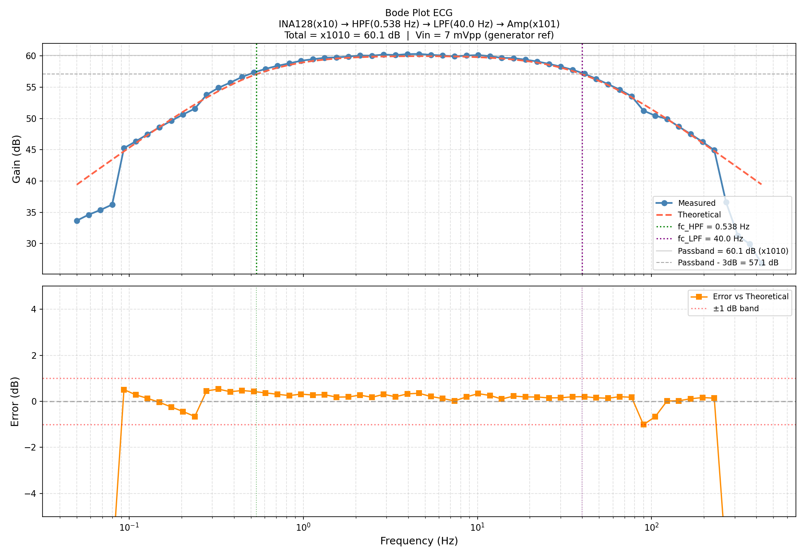

# ECG Signal Acquisition System

A real-time ECG (Electrocardiogram) signal acquisition system built from scratch, combining a custom analog front-end with embedded firmware and a Python-based visualization tool.


---

## Overview

This project demonstrates a complete biosignal acquisition pipeline — from raw electrode signals to real-time digital display with BPM detection. The system was designed and validated on a breadboard, with all analog stages verified against theoretical models using automated test scripts.

---

## System Architecture

```
Electrodes
    │
    ▼
INA128PA Instrumentation Amplifier (×10)
    │
    ▼
Analog HPF  (fc = 0.54 Hz)   — removes DC offset & baseline drift
    │
    ▼
Analog LPF  (fc = 40 Hz)     — anti-aliasing
    │
    ▼
Non-Inverting Amplifier (×101)
    │
    ▼
Bias Shift Circuit (1.65 V mid-rail)
    │
    ▼
STM32F446RE ADC (12-bit, 1000 Hz, DMA)
    │
    ▼
Digital Filter Pipeline (FreeRTOS Task)
  ├─ IIR HPF    (fc = 0.5 Hz)   — baseline wander removal
  ├─ IIR Notch  (f0 = 60 Hz)    — powerline noise rejection
  └─ IIR LPF    (fc = 40 Hz)    — smoothing
    │
    ▼
UART @ 921600 baud
    │
    ▼
Python Visualization
  ├─ Real-time ECG waveform
  ├─ FFT spectrum (0–150 Hz)
  └─ R-peak detection + BPM display
```

---

## Hardware Design

| Stage | Component | Parameters |
|---|---|---|
| Instrumentation Amp | INA128PA | Gain = ×10, Rg = 5.556 kΩ |
| Analog HPF | LM324N + RC | fc = 0.537 Hz, R = 630 kΩ, C = 470 nF |
| Analog LPF | LM324N + RC | fc = 40 Hz, R = 18.085 kΩ, C = 220 nF |
| Gain Stage | LM324N non-inverting | Gain = ×101, Rf = 100 kΩ, Rg = 1 kΩ |
| Bias Shift | LM324N + voltage divider | 1.65 V mid-rail, C = 100 µF |
| Input Protection | BAT43 Schottky diodes | Clamp to 0–3.3 V |

**Total analog gain: ×1010**  
**Power supply: ±9 V dual supply**

### Frequency Response (Measured vs Theoretical)



Frequency response was verified using automated SCPI scripts controlling the OWON DGE2070 function generator and Rigol DHO804 oscilloscope. Measured results match theoretical values with error < ±1 dB across the full passband.

---

## Firmware

**Target:** STM32F446RE (Cortex-M4, 180 MHz)  
**RTOS:** FreeRTOS CMSIS_V2  
**Toolchain:** ARM GNU GCC 15.2, Make, OpenOCD, VSCode + Cortex-Debug

| Parameter | Value |
|---|---|
| ADC | ADC1, PA0, 12-bit |
| Sampling Rate | 1000 Hz (Timer2 triggered) |
| DMA | Circular, double-buffer (256 samples) |
| UART | USART2, PA2, 921600 baud |
| FreeRTOS Task | ECG_Task, stack = 1024 words |

### Digital Filter Pipeline

```c
// Applied per sample in ECG_Task:
float hp  = hpf_filter(sample);          // IIR HPF, α = 0.9969
float ntc = notch_filter(hp);            // IIR Notch 60 Hz, BW = 20 Hz
float lp  = lpf_filter(ntc) + 2048.0f;  // IIR LPF, α = 0.2010
```

**Notch filter coefficients (fs = 1000 Hz, f0 = 60 Hz, BW = 20 Hz):**
```
b = [1.0000, -1.8596,  1.0000]
a = [1.0000, -1.7428,  0.8783]
```

---

## Software

**`software/ecg_plot.py`** — Real-time Python visualization

- Serial data acquisition from COM port @ 921600 baud
- Scrolling ECG waveform (5-second window)
- Live FFT spectrum (0–150 Hz, updated every 500 ms)
- R-peak detection using `scipy.signal.find_peaks`
- Real-time BPM calculation (10-sample rolling average)

**Dependencies:**
```
pip install pyserial matplotlib scipy numpy
```

---

## Test & Validation

| Test | Method | Result |
|---|---|---|
| Analog gain | Sine input (DGE2070) + scope (DHO804) | ×1010 ✅ |
| HPF cutoff | Automated Bode plot (SCPI) | fc = 0.537 Hz ✅ |
| LPF cutoff | Automated Bode plot (SCPI) | fc = 40 Hz ✅ |
| 60 Hz rejection | FFT before/after notch filter | > 20 dB attenuation ✅ |
| Real ECG | Chest/wrist electrodes, laptop on battery | Clear QRS, BPM ~69 ✅ |

---

## Equipment Used

| Device | Role |
|---|---|
| OWON DGE2070 | Function generator — signal source & SCPI automation |
| Rigol DHO804 | Oscilloscope — signal measurement & Bode plot |
| OWON SPM6103 | Multimeter — DC bias verification |
| LA1010 | Logic analyzer — UART signal verification |
| J-Link V9.40 | Debug probe (SEGGER Ozone) |

---

## Repository Structure

```
ECG-Signal-Acquisition/
├── firmware/ECG/          # STM32CubeIDE project (HAL + FreeRTOS)
│   ├── Core/Src/
│   │   ├── main.c
│   │   ├── freertos.c     # ECG task, digital filters, DMA callbacks
│   │   └── ...
│   └── Makefile
├── software/
│   └── ecg_plot.py        # Real-time Python visualization
├── hardware/
│   └── Schematic.pdf      # Full analog front-end schematic (Altium)
├── docs/
│   └── bode_fullchain_*.png   # Measured Bode plot
└── results/
    └── ecg_waveform.png   # Real ECG capture
```

---

## CV Description

> **ECG Signal Acquisition System** — Designed and built a complete ECG acquisition pipeline from analog front-end to real-time digital visualization. Implemented a discrete analog signal chain (INA128 instrumentation amplifier, active HPF/LPF, ×1010 total gain) and verified frequency response via automated Bode plot scripts (Python SCPI). Developed STM32F446RE firmware with FreeRTOS, 12-bit ADC/DMA at 1000 Hz, and a cascaded IIR digital filter pipeline (HPF, 60 Hz notch, LPF). Real-time Python GUI displays ECG waveform, FFT spectrum, and BPM.  
> **Technologies:** C, Python, STM32 HAL, FreeRTOS, Altium Designer

---

## Author

Huy Huynh — Electrical Engineering Student  
WSU Vancouver, WA
